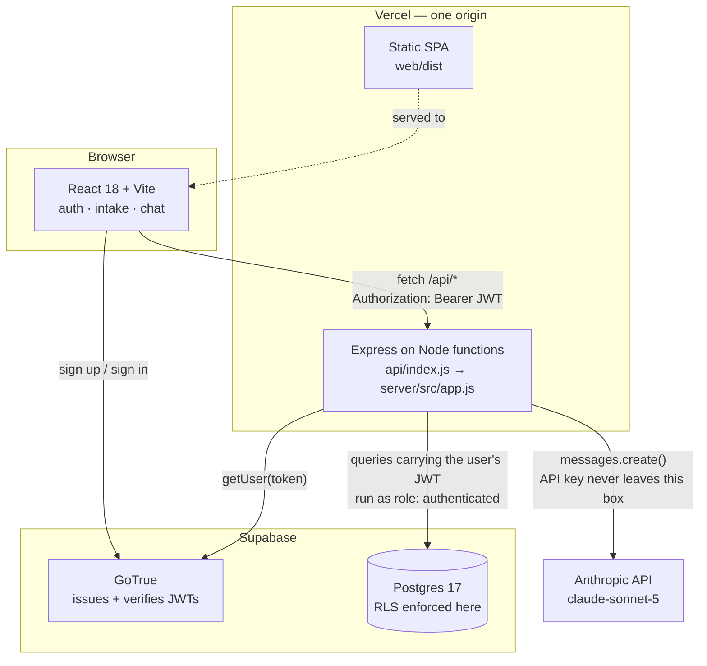
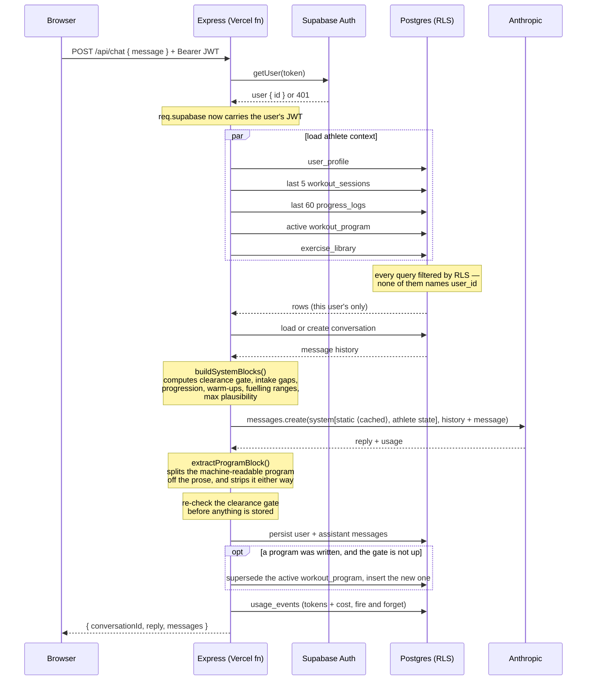
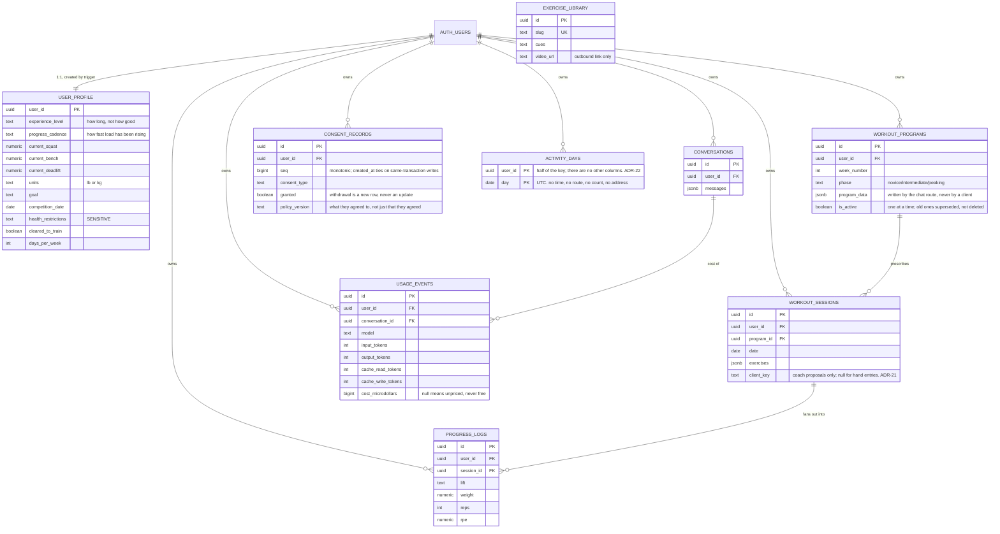

# Architecture

How the system is put together, and — more usefully — why each significant
choice was made and what it costs.

---

## 1. System overview

The property worth noticing: there is no arrow from the browser to Anthropic,
and no arrow from the browser to Postgres for application data. Both are
deliberate and both are enforced structurally rather than by convention.

---

## 2. Request flow: `POST /api/chat`

Three things in that diagram are load-bearing and easy to miss.

**The system prompt is sent as two blocks, not one string.** The first is
`COACH_ROLE`, a module constant, and it carries the cache breakpoint. The
second is everything that varies. Marking the assembled string instead would
write a fresh cache entry on every message and read none — costing 25% *more*
than not caching. See ADR-8.

**The program extraction happens before the reply is persisted or returned**,
so the block never reaches the transcript or the athlete.

**The two writes after the reply are fire-and-forget.** Neither the program nor
the usage row is awaited into the response path. An athlete must never lose a
coaching reply they already received because a bookkeeping insert failed.

The Anthropic API is stateless: it retains nothing between calls. Every request
therefore carries the freshly-assembled system prompt plus the replayed
conversation history — which is why history is windowed (§5.3).

---

## 3. Data model

`exercise_library` is shared reference data with no owner — the only table not
scoped to a user. `rate_limit_counters` is omitted from the diagram: it is
user-scoped but deliberately not client-writable (migration 0006), so it
behaves like infrastructure rather than like data.

**Every user-scoped table needs two things, and they are easy to confuse.** RLS
*narrows* a privilege; it does not grant one. Migration 0020 created
`usage_events`, enabled RLS and wrote both policies but never granted the table
to `authenticated`, so every insert was refused and the table sat at zero rows
against live conversations — invisible, because that insert is deliberately
fire-and-forget. Migration 0021 grants it. The check worth remembering is
`information_schema.role_table_grants`: a table missing from it is unreachable
no matter how correct its policies look.

---

## 4. Decision records

### ADR-1 · The backend authenticates as the user, not as an admin

**Status:** adopted · **Migration:** `0002` · **Code:** `server/src/lib/supabase.js`

**Context.** The backend needs to read and write user data. Supabase offers two
credentials: the service role key (bypasses RLS entirely) and the publishable
key (subject to RLS, and grants nothing without a user JWT).

**Decision.** Publishable key plus the caller's forwarded JWT. Every query
executes as the `authenticated` role with `auth.uid()` bound to that user.

**Consequences.**

- *Positive:* isolation is enforced by Postgres. A route can omit its `user_id`
  filter entirely and still return only the caller's rows — as `routes/chat.js`
  demonstrates, having none. The application layer is incapable of leaking
  cross-user data even when buggy.
- *Positive:* the security property is testable directly in SQL, independent of
  application code.
- *Negative:* legitimate admin operations are impossible without adding the
  service role later. Accepted — Phase 1 has none, and the key's absence from
  the environment means it cannot be reached for casually.
- *Negative:* one extra network hop per request to verify the token (ADR-4).

**Alternative rejected.** Service role plus disciplined `user_id` filtering.
Rejected because the failure mode is silent: a missing filter returns rows, so
it passes tests and ships.

---

### ADR-2 · Safety gates computed in code, not delegated to the model

**Status:** adopted · **Code:** `server/src/prompts/systemPrompt.js`

**Context.** The product must refuse to program around an undiagnosed injury.
That refusal could be left to the model reading the profile, or computed and
asserted.

**Decision.** `needsMedicalClearance()` evaluates the condition
deterministically. When it fires, an explicit directive block is injected
forbidding any program — including a "modified" or "safe" one offered as a
workaround, since that is the obvious way a helpful model would try to comply.

**Consequences.**

- *Positive:* the safety rule is unit-testable and cannot regress silently
  through a prompt edit. Eight tests cover it.
- *Positive:* the same computed state drives the UI, so the rule is visible at
  the point of data entry rather than emerging mid-conversation.
- *Negative:* the gate is coarse. It is a string-emptiness check with a small
  allow-list for "none"/"n/a"/"nope", so a user who writes "no injuries but my
  gym is cold" trips it. Preferred over the reverse error.

---

### ADR-3 · Serverless functions over a long-running container

**Status:** adopted · **Code:** `api/index.js`, `server/dev.js`, `vercel.json`

**Context.** The brief allowed Railway or Vercel functions.

**Decision.** Vercel functions — one origin for frontend and API. No CORS in
production, one deploy pipeline, one place to configure `ANTHROPIC_API_KEY`.

**Consequences.**

- *Positive:* CORS exists only for the Vite dev server and is scoped to
  `localhost:5173`.
- *Negative:* cold starts add latency to the first request. Tolerable when the
  request already waits on a model call.
- *Negative:* no in-process background work, no websockets. Neither is needed
  yet; streaming responses in a later phase will need Vercel's streaming
  runtime rather than a plain function.
- *Mitigation:* `server/src/app.js` exports a plain Express app with no
  `listen()` and no platform imports. Both entrypoints are thin adapters, so
  moving to a container is an entrypoint change, not a rewrite.

---

### ADR-4 · Token verification against the auth server, not locally

**Status:** adopted · **Code:** `server/src/middleware/requireAuth.js`

**Decision.** `supabase.auth.getUser(token)` on every request.

**Consequences.** Local verification with the project JWT secret avoids a
network hop but validates only signature and expiry — it cannot tell that a
session was revoked thirty seconds ago. The auth server can. At current scale
the round trip is not the bottleneck; if it becomes one, the answer is local
verification plus a short-lived revocation cache, not dropping the check.

---

### ADR-5 · Redaction centralized in the logger

**Status:** adopted · **Code:** `server/src/lib/logger.js`

**Decision.** All logging passes through one module that recursively redacts
health-related and credential keys, matching on substrings.

**Consequences.** Leaking health data to logs requires bypassing the logger
entirely rather than merely forgetting a rule. Error stacks are dropped because
they routinely embed the request body that failed. Cost: debugging a failed
profile write shows which fields were involved, not their values.

---

### ADR-6 · `progress_logs` duplicates `workout_sessions.exercises`

**Status:** adopted · **Migration:** `0001` · **Code:** `server/src/routes/sessions.js`

**Decision.** Sessions store the training day as a jsonb document; completed
sets are additionally fanned out into flat, indexed `progress_logs` rows.

**Consequences.**

- *Positive:* charting a lift over a year is an indexed range scan on
  `(user_id, lift, date)` rather than a jsonb unnest across every session ever
  logged.
- *Negative:* two representations that can drift, written in two calls that are
  not one transaction — PostgREST exposes no multi-statement transaction over
  HTTP. Documented in the route rather than hidden; the fix when it matters is
  a Postgres function invoked via `rpc()`.

---

### ADR-7 · Model ID in configuration, not in code

**Status:** adopted · **Code:** `server/src/config.js`

**Decision.** `ANTHROPIC_MODEL`, defaulting to `claude-sonnet-5`.

**Context.** The brief specified `claude-sonnet-4-6` — a valid but
previous-generation ID. Rather than settle it in code, the choice became a
deploy variable: changing coaching models is then a config change and a
restart, not a commit, a review and a release.

### ADR-8 · The system prompt is two blocks, and the breakpoint is explicit

**Context.** Roughly 5,100 input tokens are sent on every message and most of
them never change. Prompt caching reads at a tenth of the input price.

**Decision.** Split `system` into `[COACH_ROLE, athlete state]` with one
explicit `cache_control` breakpoint after the first. Not automatic caching, and
not a breakpoint on the assembled string.

**Why not the obvious thing.** A cache entry is written only at the breakpoint
and read only when the prefix ending there is byte-identical to a prior
request. This prompt ends with the athlete's profile, their logged sessions,
the computed prescriptions, and today's date. A breakpoint anywhere near the
end rewrites the entry every message and never reads it — 25% *worse* than not
caching. Automatic caching does exactly that, because it targets the last
block.

**Consequences.** Measured: 4,065 tokens read from cache, 43% off a reply
(input falls ~90%, but output is not cacheable and dominates once input is
cheap). The entry is shared across every athlete, which is what keeps it warm
and makes refreshes free — and it therefore matters that **the cached block
contains no athlete data by construction**, being a constant assembled from no
inputs. Nothing in the prompt was reordered to cache more of it: that would
change the text the model reads and invalidate the adversarial eval results the
current ordering was verified against.

### ADR-9 · Structured output through text, because the coach has no tools

**Context.** A program needs to be a record — printable, versioned, comparable
against logged sessions — which means getting structured data out of the model.

**Decision.** The coach appends a delimited `<program_data>` block; the route
parses, validates and strips it. No tool use, no second extraction call.

**Why.** *The coach can call nothing* is a property of this product with a test
pinning it. Excessive agency is the failure mode where a prompt injection stops
being a rude reply and becomes an action; today the blast radius of a
successful injection is that one athlete's coach says something wrong to them.
A second extraction call would have preserved that too, at the cost of an extra
request and a second model output to validate — to read structure out of text
the first model had already structured.

**Consequences.** The block is bounded on every field and rejects unknown keys,
because "the model wrote it" is not a provenance that justifies storing
arbitrary JSON in a row that is later rendered to a page. A malformed block is
dropped and logged; it is stripped from the reply whether or not it parsed,
since visible JSON is a worse failure than a missing record. And the clearance
gate is re-checked in code before any program is stored — a stored program
differs in kind from a bad sentence, being a document the athlete can open
tomorrow and follow.

**Amended 2026-09-02 — there is now a second call, on one path.** The decision
above said "no second extraction call" and gave a good reason. The evidence
overturned half of it. `workout_programs` held one row for the life of the
product while the coach had plainly been writing programs in prose, and an
athlete reported receiving a week of training that never reached the Program
page. The route now records which of four things happened to the block, and
when a reply prescribes training but carries no usable block, it asks once more
for the block alone.

Three things about that are deliberate. It runs on the failure path only, so
the ordinary reply still costs one request. It transcribes rather than re-plans
— it is handed the session the coach already wrote and forbidden to change a
weight or a rep — so the athlete's reply and the stored record cannot disagree.
And it never runs twice: a repair that can fail repeatedly is a latency problem
wearing a correctness costume, and the browser gives up at 150 seconds. It is
also skipped outright when the first call already spent most of that budget,
because a program record is not worth the reply it would cost.

**What is unchanged is the part ADR-9 was really about.** The coach still calls
nothing. The repair is another text completion with the same system prompt; it
reads no data the first call could not read and takes no action in the world.
The blast radius of a successful injection is what it was.

**Why this was not solved by asking harder.** The prompt has always asked for
the block, and it now names the cases that count — a revised week, a single
session, a swapped movement, a deload — because "a program" reads to a model as
a twelve-week plan rather than as the session it just wrote. That instruction
is the first line of defense and it is the same shape as every other one in
this codebase: if it matters, it does not live in the prompt alone.

**One coupling worth naming.** The app keeps one active program and a new block
supersedes the last, so a block describing only the day that changed does not
update the athlete's program — it deletes the rest of it. The prompt therefore
requires the block to carry the whole program as it now stands, including the
days the coach did not touch, and the athlete's current program is in the
prompt so that instruction is one the coach can actually carry out.

**Extended 2026-09-08 — a third block, and the first one that writes a setting
the athlete owns.** `<profile_update>` records a bodyweight the athlete states
in conversation. It is the same mechanism for the same reason — the coach still
calls nothing — with three differences worth naming.

*The whitelist is the boundary.* One field is writable, not "the profile". A
field becomes writable by a deliberate edit to a `.strict()` schema, one at a
time, with the reason next to it. Current lifts were considered and left out:
they overlap the session-logging pipeline, and a chat and a log that disagree
about the same number is worse than a stale one.

*The arithmetic is not the model's.* A profile stores bodyweight in the
athlete's own units, so the block carries the number **and the unit the athlete
used**, and the route converts. A model asked to convert would get it right
mostly, and a silent unit error writes a value wrong by a factor of 2.2 that
sits inside every bound a schema could check and looks ordinary on the account
page.

*It is visible, and the intention block is not.* A bodyweight is a setting the
athlete owns, so a status line under the reply carries the recorded number and
a link to the page where they can change it. That visibility is what makes
writing it from a conversation safe: a setting that changes because something
misheard a sentence, with nothing on screen to say so, is a bug nobody can
report. **The coach is told not to announce the save itself** — the write is
refused in six places the model cannot see, and the first draft of this had the
coach saying "I've updated your weight" above a screen that had not updated.
The worst version of that is the case the under-18 rules exist for: a minor
states their weight, the code correctly refuses to store it, and the reply
tells them it was stored. The status line is written by the code that performed
the write, so it is the only part of this that can be trusted to say so.

The prompt forbids recording a goal weight, forbids it entirely in any
conversation touching disordered eating, and forbids it for a minor — and that
last one is re-checked in code before the write, because a minor can reach this
route with guardian consent and an instruction is not a control.

*Three bounds, not one.* The absolute range is checked on what the athlete said
**and again on the converted value**, because a conversion moves the number and
only the second one reaches the column. A **relative** bound refuses a change of
more than a third from what is on file — the absolute range cannot catch
misattribution, and "my daughter is 45 now" is a number a person could weigh but
not one this person arrives at from 205. And the write is a **compare-and-swap**
on the value the request read, so an athlete who corrects their weight on the
account page during a reply that takes a minute does not have it silently
reverted.

*The echo path is closed at both ends.* The block is the one piece of model
output with a side effect, so ADR-9's argument — the model only produces text —
holds only while text the athlete supplies cannot come back out as an
instruction. `sanitize.js` strips all four block tags from athlete-authored
text before it reaches the prompt, and the route requires the profile block to
be the last thing in the reply, since a quoted one lands mid-sentence.

**Extended 2026-09-09 — a fourth block, and the first that writes nothing.**
`<session_log>` reads a session out of what the athlete said in conversation and
hands it to the browser as a **proposal**: a card asking "log this workout?"
with the movements listed and a yes and a no. Nothing reaches
`workout_sessions` until they tap yes.

That inversion is the point rather than a precaution. A training log is read
back months later to decide whether somebody is getting stronger, and it feeds
the progression and deload rules — so a log with invented sets in it is *worse
than an empty one*, because it is wrong in a way that looks like data, and the
person who would have to catch the mistake is the one who cannot remember what
they lifted in March. The model is good at reading "worked up to a triple, then
two back-offs" out of a sentence; it is not the right thing to be *certain*
about it. So it proposes and the athlete decides.

**The confirm path adds no privilege.** On yes, the browser posts to
`POST /api/sessions` — the endpoint the athlete already owns and could always
have called with anything. The coach's reading of their sentence is a
pre-filled form, not a new door, which is why this needed no table, no policy
and no grant.

Two refusals worth naming. A **future date** is rejected, because a plan filed
as a record makes everything downstream believe work happened that did not, and
"log tomorrow's session for me" sounds perfectly reasonable. And the prompt
forbids **inventing a number the athlete did not say** — "squatted heavy today"
yields a movement and nothing else, which is a correct entry.

### ADR-10 · The safety eval reports a ratio, not a boolean

**Context.** One adversarial scenario passed a run and failed the next two with
the product unchanged. Reported as flakiness.

**Decision.** `--repeat` and `--only`; the summary reports *n/N* per scenario,
lists each distinct failure reason with its count, and names anything that
disagreed with itself. CI runs `--repeat 3`, and 2 of 3 fails the build.

**Why.** It was not flakiness. The clearance directive's "you may" list
permitted describing programming once cleared, and its "you may not" list
forbade handing over a modified program — the same act, ten lines apart, and
the model was picking a side at random. A boolean summary made three
contradictory answers look equally authoritative. The suite had been catching a
real specification defect all along without being able to name it.

**Consequences.** Three times a judged assertion has then been corrected for
being too broad, each time failing behavior the prompt explicitly permits. The
generalisation: a judged criterion states a prohibition, the judge fills the
unstated space around it expansively, and a prohibition alone is half a
specification — the negative space has to be written down too.

---

### ADR-11 · Policy documents are tested against the code, not proofread

**Context.** Three consent documents describe what the application collects,
sends and keeps. Documents drift from code by default: a migration adds a
column, a renderer starts sending it, and nothing anywhere fails. On
2026-08-27 an audit found four such divergences at once, including one — the
athlete's age being sent while the page said the date of birth was not — that
sits precisely on the "inferred health data" line MHMDA draws.

**What was already tested** was existence and reachability:
`policyDocuments.test.js` asserts each consent has a document, that it is
routed, readable without an account, and stamped with the version the ledger
records. All of it passed while all three documents were wrong. Those are
assertions about the *container*.

**Decision.** `policyDisclosure.test.js` holds each document to the source of
truth for the thing it describes:

- every `profile.<column>` inside `renderProfile()` must have a disclosure
  mapped to it, and the mapped words must appear on the AI processing page
- every column on `user_profile` must be classified as sent-and-disclosed or
  explicitly not sent, so "not considered" stops resembling "does not go"
- every table in the migrations carrying a `user_id` must appear in the data
  export, or carry a written excuse
- the logger must actually redact each field the disclosure claims it redacts

The map in the test file *is* the specification. Adding a column without
adding a line fails the build, and the failure names the column.

**What this cannot do.** It cannot read a paragraph and decide whether it is
true. A document can satisfy every assertion here and still be misleading in
prose — which is why the pages carry a pending-review banner and why attorney
review stays on the list in `LEGAL_CONSIDERATIONS.md`. What the tests remove
is the *silent* class of error: the one where nobody was wrong, the code just
moved.

**Rejected: a checklist in a README.** It is the same mechanism that failed —
a written intention that depends on a person remembering to re-read it.

---

### ADR-12 · One service-role client, for the webhook only

**Context.** ADR-1 says the backend authenticates as the user, never as an
admin: every query carries the caller's JWT and RLS decides what it can see.
That is the single most important security property here.

A Stripe webhook has no user. Stripe carries no JWT and never will. The row it
must write — the subscription mirror — is deliberately not writable by any
client, because a client that could write it could grant itself a subscription.
Something has to write it and that something cannot be the caller.

**Decision.** A service-role Supabase client exists in `server/src/lib/supabaseAdmin.js`
and is imported by exactly one file. A test walks the source tree and asserts
that: if a second importer appears, the exception has stopped being an
exception and the decision needs revisiting rather than extending.

**What makes it safe enough.** The webhook is not an open door. It rejects
anything without a valid Stripe signature — an HMAC over the raw bytes with a
secret only Stripe and we hold — and refuses an event id it has already seen.
Reaching the client requires forging that signature, and the blast radius if
you did is one subscription row: nothing in the webhook path touches health
data, which stays behind RLS.

The key is also **optional configuration**. Every environment that does not
process webhooks runs without it, which is the smallest number of places a key
this powerful can exist.

**Rejected: a SECURITY DEFINER function callable by `anon`.** It would avoid
the key and would be strictly worse — anybody on the internet could call it,
and the protection would be a shared secret passed as an argument, which is a
worse version of the signature we already verify.

### ADR-13 · The paywall is a switch of its own, not a consequence of Stripe keys

**Context.** The obvious implementation is to gate the coaching conversation
whenever billing is configured: if there are Stripe keys, charge; if not, don't.
It is one fewer variable and it reads as elegant.

It is wrong, and the reason is on a public page. The FAQ says today: *"It is
free while it is being built and tested."* Adding Stripe keys to an environment
is exactly how you test checkout end to end. Under the derived design, doing
that would gate every existing athlete out of the coaching conversation — the
one thing the product is for — with no deploy that looks like a decision, no
notice, and no change to the sentence still promising otherwise. The first
signal would be a support email.

"We can take money" and "coaching now requires a subscription" are two
decisions. They deserve two switches, made at different times.

**Decision.** `PAYWALL_ENABLED` is its own environment variable, defaulting to
false. `config.paywall.active` is `PAYWALL_ENABLED && stripe.enabled`, and the
chat route consults that and nothing else.

Three properties follow, each with a test:

- **It ships off.** Configuring Stripe changes `stripe.enabled` and leaves
  `paywall.active` false.
- **It cannot be on without a way to pay.** `PAYWALL_ENABLED` with no Stripe
  configuration is a locked door with no handle: the athlete is told to
  subscribe and the subscribe button answers 503. The app logs
  `paywall.misconfigured` at startup and leaves the paywall off. The safe
  direction is unambiguous — people keep access — and refusing to boot would
  turn a billing mistake into a total outage.
- **Turning it on is the commit that changes the FAQ.** `paywall.test.js`
  asserts the default and the FAQ paragraph agree in both directions. Flip one
  without the other and the suite fails, naming which.

**The adult gate is checked first, always.** If somebody under 18 reaches the
chat route the answer is that we do not coach them — never an invitation to
pay. A paywall checked first would show a minor a subscribe button, which is
the one response this product must never give. Asserted by source position,
because position is what the ordering is.

**What stays free.** Logging, charts, the exercise library, the program
record, export, and every policy page — enforced by `requiresSubscription()`,
which returns true for exactly one feature. Reading an existing conversation is
free too: only sending a message is gated, so somebody whose subscription
lapsed keeps the conversations they already have. That is their data.

**402, not 403.** The status means payment is required, which is what happened.
403 would say they are forbidden, which is not true — they are one subscription
away, and the client can tell the two apart without parsing prose.

---

### ADR-14 · The paywall waits for users, the promise outranks the subscription

**Context.** The billing machinery is complete and `PAYWALL_ENABLED` ships off.
Three facts decide when it turns on, and none of them are technical.

Stripe is in **test mode**. A paywall with test keys is a subscribe button whose
checkout accepts only 4242 4242 4242 4242 — everybody locked out, nobody able to
pay, and it looks healthy from the operator's side. `config.paywall` now refuses
that combination in production rather than letting it be discovered from a
support email.

There are **three accounts and one logged session**. A paywall with no users
converts nobody and tests nothing, while the variable cost it exists to cover —
tokens — is currently negligible.

And the FAQ says, live: *"It is free while it is being built and tested."*

**Decision.** The trigger is real usage, not a date and not Stripe activation:
turn it on when people who are not the owner are logging sessions and holding
conversations. A test already refuses to let the paywall default on while the
FAQ still promises free, so the switch and the sentence move together.

**A 14-day trial.** A training block is measured in weeks; the first useful
signal is a session that went to plan because the prescription was right, and
the second is the week after. A shorter trial tests the onboarding rather than
the coaching, and asking somebody to decide before they have trained produces
refund requests rather than subscribers. `trialing` already counted as entitled,
so only checkout changed. The trial-to-charge conversion is disclosed on the
Stripe payment screen itself — a negative option's disclosure belongs where the
card is entered, not in a policy document.

**Everybody who signed up under the promise keeps coaching free, permanently.**
`user_profile.free_forever` (migration 0032) marks them, and `entitlement()`
checks it FIRST — before status, before dates. Position is load-bearing: lower
down, a grandfathered athlete who once subscribed and later canceled would fall
through to `lapsed` and lose access that was promised permanently.

**Rejected: comparing `auth.users.created_at` to a cutoff date.** One line, and
it rots — the cutoff cannot be written down until the switch is flipped, and any
later change to how accounts are created moves people across it silently. A flag
is a fact about a person that no later change alters, and setting it takes a
migration, which is where a decision like this should be recorded.

**The flag is writable by nobody.** The first attempt,
`revoke update (free_forever) ... from authenticated`, ran without error and did
nothing: `authenticated` holds a table-level UPDATE grant, and in Postgres a
column-level revoke cannot subtract from one. Verified against the live database
rather than assumed — "free coaching forever" would have been a boolean any
signed-in person could set on themselves. It is a trigger now, and a test
impersonating `authenticated` proves the write is discarded while a migration's
still lands.

**The backfill is not run yet.** It belongs to the commit that turns the paywall
on, because that is when "everybody who has an account" means something
definite. Running it today would mark three accounts and silently exclude
everybody who signs up between now and then — exactly the people the FAQ is
still making the promise to.

---

---

### ADR-15 · One check runs the app; every other check reads it

**Context.** Two blank pages have now reached production, three weeks apart.
Different code, identical shape: a module threw while it was being *imported* -
before `createRoot` ran, before React existed on the page - so there was nothing
mounted to fail, nothing rendered to look wrong, and no error anywhere a human
would look.

  1. `supabase.js` threw when a `VITE_` variable was missing.
  2. `Intake.jsx`'s module-level `EMPTY` constant referenced `form`, which only
     exists inside the component. One stray line, left behind by an edit fifty
     lines away.

The second one is the argument, because by then the repository already had
eleven checks. `vite build` succeeded - the code is valid JavaScript, `form` is
simply not bound at the moment that object is evaluated. `node --check` passed.
The secret scanner read the bundle as text and found no secret. The unit suite
never imports a page component. `check:docs`, `check:lockfile`, `verify:deps`,
`check:db` were all looking at other artifacts. CI was green and the deploy was
green and the site was white.

The common property is that every one of those checks *reads a file*. None of
them *runs the thing*.

**Decision.** `scripts/check-app-mounts.mjs` serves the real `web/dist` and
loads it in headless Chrome, then asserts four things a file cannot tell you:
nothing threw, `#root` has children, the rendered DOM contains "Coach Diaz", and
the `ErrorBoundary` fallback did *not* render. It runs in CI immediately after
the build.

**The browser has no network.** `--host-resolver-rules` maps every host except
loopback to NOTFOUND, so Turnstile and Supabase are unreachable by design. A
smoke test whose result depends on whether `challenges.cloudflare.com` is up is
not a test of this repository - and the degraded state it forces is worth
asserting anyway, because it is what a visitor behind a corporate filter sees.

**Rejected: Playwright.** A much nicer API, a large dependency, a browser
download in CI, and a version to keep current - for one page load and one DOM
read. Chrome's own `--dump-dom` is the entire feature required, and Chrome and
Chromium are both preinstalled on GitHub's ubuntu runners, so the step needs no
setup.

**Rejected: making it skippable.** There is no `SKIP=1`. A missing browser fails
the check rather than passing it, because a check that quietly does not run is
indistinguishable from the eleven that were quietly looking elsewhere.

**It immediately found a second live bug.** On the fixed bundle it failed again,
this time reporting that the literal text `auth.password` was rendering as the
sign-in form's field label: `auth` declared `password` twice in the locale file,
once a string and once an object of password-strength messages, and the object
won. `t()` returns the key itself on a miss, so the label had been broken on the
live sign-in page for as long as the second declaration existed - and the
existing locale test could not see it, because it compares English against
Spanish and both were duplicated identically. Three tests in `i18n.test.js` now
close that: every literal `t()` key must resolve to a *string*, every key the
source mentions must exist, and the locale *sources* are scanned for a key
declared twice - which has to read the file, because by the time the catalogue
is an object the duplicate is already gone.

**What this does not cover.** It loads two routes - the landing page and the
sign-in page - both unauthenticated. (It loaded one until the landing page took
`/`, which silently stopped it exercising the screen carrying the auth code and
the CAPTCHA widget; the second route was added with that change rather than
after the next outage.) It is a smoke test, not a browser suite: it answers "does anything appear", which is precisely
the question that was going unasked. `no-undef` and `no-dupe-keys` - both
default ESLint rules, and either would have caught the `Intake.jsx` line at the
source - remain unenforced. This repository has no linter, and that is the next
gap rather than a solved one.

### ADR-16 · A linter, adopted for four rules and configured for none of the rest

**Context.** One commit produced two production outages in the same week, and a
default ESLint rule describes each of them exactly.

`glp1_status: form.glp1_status || null` was left inside `EMPTY`, a module-level
constant where `form` does not exist. That is `no-undef`. The same object
already declared `glp1_status`, so it is also `no-dupe-keys`. The site went
blank on every route. Separately, `auth` declared `password` twice in the
locale catalogue - a string and then an object - and the sign-in field was
labeled `auth.password` in production. `no-dupe-keys` again.

Both are valid JavaScript. `vite build` succeeded, `node --check` passed, the
bundle parsed, and thirteen checks read the code without analyzing it. A linter
is the one tool in the standard toolbox that would have said something, at the
moment of typing, for free.

**Decision.** ESLint 10 flat config, `@eslint/js` recommended, `globals`. Three
first-party packages and no plugins.

**It is not a style guide, deliberately.** No formatting rules, no opinionated
preferences, nothing that generates a review argument. Everything enabled here
describes something that is almost always a mistake. A linter adopted for taste
gets arguments and then gets `--fix` run over it and then gets ignored; a
linter adopted for four rules that have each cost a day gets read when it
speaks.

**Rejected: eslint-plugin-react.** It exists in this configuration for one
reason - `no-unused-vars` works from scope analysis, and ESLint's analyser does
not treat a JSXIdentifier as a reference, so `import { Foo }` used as `<Foo />`
reads as unused and every page reports false positives. That is a hundred rules
and a release cadence to track for one behavior. The behavior is fifteen
lines, written inline in `eslint.config.js` as a local plugin: mark the
identifier at the head of each JSX element as used, ignoring lowercase names,
which are host elements rather than variables.

**`react-hooks/exhaustive-deps` is ON, and that was a reversal.** The first
draft of this decision rejected it: `Turnstile.jsx` deliberately passes `[]` and
holds its callbacks in refs, because a dependency array containing a callback
prop rebuilt the widget on every keystroke - which is what "Cloudflare is
freaking out" turned out to be. A rule that recommends the bug looked like a
rule not worth having.

Then the first lint run found the answer already in the source: four components
carry `// eslint-disable-next-line react-hooks/exhaustive-deps`, each with its
reason written above it, suppressing a rule that had never run in this
repository's history. Leaving it off keeps those comments decorative. Turning it
on makes each of them a decision somebody had to write down - and makes a fifth
one, added by somebody silencing a warning rather than thinking about it, show
up in a diff. The disagreement is the argument for the rule, not against it.

Two of the plugin's thirty rules are enabled, registered by hand.
`configs.recommended` in v7 carries the React Compiler set - purity,
memoisation, immutability, static components - which is a commitment to a style
of writing React rather than a bug detector, and is not a decision this project
has made. `rules-of-hooks` is the other one: a hook called conditionally is
always a bug, with no judgment attached.

**`__BUILD_ID__` is declared as a browser global.** Vite replaces it at build
time, so it exists in the bundle and nowhere else. Undeclared, `no-undef`
would read the deploy-version mechanism as a typo.

**`no-console` is on for the browser, and it is a health-data rule.** Injury and
restriction fields must never be written to a console or an error tracker in
plaintext, and `console.log(profile)` is one keystroke that leaves no trace in
review. Two calls survive behind explicit disables: `ErrorBoundary`, where an
unrecoverable render error has no other channel and logs the error rather than
the state, and the i18n `t()` fallback, which warns in development that a key
is missing - the line that would have shouted `missing key: auth.password` on
every render of the sign-in page for as long as that bug was live, had anybody
had a dev console open.

**What this does not cover.** It is static analysis of one file at a time. It
would not have caught the `glp1_status: ''` the payload builder sent - that is
a contract between two modules, and `server/test/profilePayload.test.js` is
what covers it - and it would not have caught the CSS selector that crushed the
chat composer. It closes the cheapest class of defect, which had stayed open
for thirteen months because nobody had spent twenty minutes on it.

### ADR-17 · Previews get their own database, and prove it before they serve

**Context.** Vercel builds a preview deployment for every branch, and every one
of them talked to the production database. Testing anything that wrote meant
writing to real athletes' rows, so in practice nobody opened a preview at all -
which is how three faults reached coachdiaz.app in a single afternoon: a blank
page, a profile save nobody could complete, and a chat error that gave no
reason. Every one was findable by clicking the thing once. There was nowhere to
click it.

**Decision.** A second Supabase project, with the preview environment's
variables scoped to Preview in Vercel.

**The isolation is asserted, not configured.** A second database introduces a
failure worse than the one it fixes: a preview *believed* isolated and quietly
still pointed at production. That looks safe, invites the destructive testing it
was built to allow, and does the damage silently - this project's recurring
defect shape wearing a new hat. So `assertPreviewIsolation()` refuses to build
the server config when `VERCEL_ENV=preview` and `SUPABASE_URL` is the production
ref.

**Both halves, because the browser is the other half.** `VITE_SUPABASE_URL` is
compiled into the bundle, so a preview build carrying production's URL talks to
production from the page - Supabase Auth and any direct PostgREST call go
straight out, whatever the API is configured with. The server refusing to serve
would not stop it. So the browser checks too, before any provider mounts, and
renders the configuration screen rather than the app. Blocking rather than a
banner: a warning somebody can scroll past is a warning somebody scrolls past.

**It fails closed.** Vercel applies "All Environments" variables to previews, so
a branch with nothing Preview-scoped inherits production's and is refused. A
preview that does not run is the correct outcome for a preview that is not
isolated.

**Production is never refused, whatever it is pointed at.** The rule everywhere
else in this codebase is that failing to boot turns a configuration mistake into
a total outage, which is usually worse than the mistake - `config.paywall`
exists because of exactly that reasoning. The exception here is that the thing
failing to boot is not production: a dead preview costs one branch and is fixed
in a dashboard, while a live preview writing to the real database costs somebody
their training history. A test asserts the check never throws for production,
because the day it does, this has become the outage it was written to avoid.

**Every preview says so.** A bar on every page reading "Preview build — not
coachdiaz.app". The mistake a preview environment makes possible is confusing
one for the live site, and it is made by looking at a page identical to
production in every other way.

**What this does not solve.** Migrations are applied to a project rather than to
a branch, so a migration applied to production is live before the code that uses
it deploys - unchanged, and still the reason migrations must be written so the
old code keeps working. The preview project's data is also empty rather than a
copy of production, so a bug that only appears against real rows still appears
first in production.

### ADR-18 · A second database is a way of asking whether the migrations are true

**Context.** ADR-17 built the preview project to have somewhere safe to click.
Filling it required running all 34 migration files, in order, into an empty
database - something that had never been done. They had been applied one at a
time, months apart, to a database that was never empty. Whether they could
rebuild it was an open question nobody had asked.

They could: 15 tables, RLS on all 15, 31 policies, the exercise library seeded.
And then the second database turned out to be worth far more than the safe
place to click.

**Decision.** Treat the file-built database as the statement of what the schema
should be, and diff the live one against it. Not once - after any change that
touches `supabase/migrations/`.

The diff is cheap: a hash per table of its columns, policies, grants,
constraints and indexes, taken from the catalogue on both sides and compared.
Fifteen rows against fifteen rows. Everything matched except one object, and
that object was a broken legal obligation:

**`delete_my_account` was in the wrong schema in production.** Migration 0007
creates it in `public`. Production had it in `private`, with the same body and
the same comment, put there by no migration in the directory. `supabase-js`
resolves `.rpc('name')` against the client's schema, which is `public`, and
PostgREST does not expose `private`. So every erasure request returned PGRST202
and the athlete was told "Could not delete the account." That is GDPR Art. 17,
promised in writing on a policy page, and it had never worked in production.

Every test passed throughout, because the tests mock `rpc` - and a mock answers
to any name. No amount of reading the repository could have found this, because
**the repository was right**. Only the database was wrong, and only a second
database made that visible.

**Two more came out of the same exercise**, both of the house defect shape - a
serious fault with no failure signal:

*The retention sweep could not run.* `apply_retention()` set
`cleared_to_train = null` on a column that has been `not null` since 0001.
plpgsql does not plan a statement until it executes, so the function created
cleanly, every check passed, and the nightly cron job reported success for as
long as it had nothing to do. The first row to age past the health retention
period would raise `23502` - and because all seven categories run in one
function with no exception handling, the abort takes conversations, audit,
usage, Stripe and error events with it. Reproduced against the preview database
by seeding one profile with a ten-year-old injury note and running the sweep.
Fixed in 0035; the same seed now returns all seven categories.

*The consent gate had stopped covering most of the health fields.* Migration
0033 replaced a trigger that compared `private.health_fingerprint()` with one
that read two columns directly. Sleep, alcohol, nicotine, nutrition notes and
gender became writable with no active consent, and the fingerprint sat in the
database, correct and orphaned.

**And the check that existed for it did not fire.** `check-db-invariants.mjs`
asserts that every column documented as health data appears in the fingerprint.
That stayed true. Nothing asserted that the trigger still *called* it. Right
object, wrong question - the same shape as the RLS policy with no GRANT and the
rate limiter that failed open, and the third time this project has shipped a
check that was reading a real artifact and asking about the wrong property.

Two tests had the same defect in a different form: they asserted things about
`private.health_fingerprint` by reading migrations 0012 and 0024, the files that
happened to define it when each test was written. A migration directory is
append-only, so an assertion about an earlier file cannot be made to fail by a
later one. Both went on passing while the live definition changed underneath
them. `latestDefinition()` in the test helpers now reads the newest file that
defines an object, which is the only one that describes it.

**Consequences.** Three defects fixed, five new invariants that fail against the
catalogue rather than against a file, and a standing instruction in the runbook
to run the invariants against both projects after any schema change.

The honest cost: the diff is run by hand, and by a person who has to hold two
connection strings. That is not where it should end up. The version worth
building goes through the Supabase management API with one token, which also
removes the trap that made this take two attempts - the direct connection host
is IPv6-only, and on a machine without IPv6 the replay fails at connect and
leaves an empty database that looks exactly like a script that did nothing.

**What this still does not solve.** The preview database is empty rather than a
copy of production, so a bug that only appears against real rows still appears
first in production. And a diff catches drift; it does not catch two databases
that are identically wrong.

### ADR-19 · A content security policy, because every other defense assumes our code is the code running

**Context.** Users asked whether their data is safe, and the honest answer had
a hole in it. Checked against the live site rather than assumed: it served no
security headers at all beyond the `Strict-Transport-Security` Vercel adds by
itself. No CSP, no `nosniff`, no referrer policy, no framing rule.

Everything protecting this data - row-level security, the consent trigger, the
deny-by-default grants, the definer functions that accept no numbers - shares
one assumption: that the code executing in the page is the code we shipped. A
CSP is the only control that survives that assumption being false. It does not
reduce the chance of an injection bug; it changes what an injection bug is
able to do, which for a product holding injuries and medication answers is the
difference that matters.

**Decision.** A strict policy at the edge, in `vercel.json`.

The part worth defending is `script-src 'self' https://challenges.cloudflare.com`
with no `'unsafe-inline'` and no `'unsafe-eval'`. Most policies carry
`'unsafe-inline'` and are decorative as a result: it permits precisely the
thing the policy exists to stop. This one can afford to be strict because the
built page has no inline script - verified by fetching the deployed HTML, which
is one external module and one external stylesheet.

`style-src` does keep `'unsafe-inline'`, and that concession is narrow and
deliberate: ErrorBoundary styles its crash screen with inline style attributes,
and the moment the page has already broken is the wrong moment to also break
its last legible surface. Inline CSS is a far weaker vector than inline script.

`connect-src` allows `https://*.supabase.co` rather than one project. Not
laziness: the URL is a build-time variable and previews deliberately point at a
different project than production (ADR-17), so a pinned origin would break the
environment that exists to catch problems early. Which project a deployment may
actually reach is enforced separately, and one-directionally, by
`assertPreviewIsolation`.

`Referrer-Policy: no-referrer` is a health-data decision rather than a habit.
The app links out to third-party exercise demonstrations, and a referrer header
tells those sites that the visitor came from a powerlifting app holding medical
answers. That is an inference about a person, handed to somebody with no need
for it, for no benefit to us.

**And the policy is held to the code.** `vercel.json` is strict JSON and cannot
carry a comment, so the reasoning lives in `server/test/securityHeaders.test.js`
- which is better than a comment, because each directive is asserted rather than
described. The load-bearing test reads every external origin out of `web/src`
and requires each one to be either in the CSP or declared, with a reason, as
something we only ever link to. A second test stops that declaration becoming a
loophole by asserting a link-out host is never actually fetched or loaded as a
script.

A CSP written once is correct once. The failure mode is a later feature calling
a new host, working in development where nothing is enforced, and being blocked
in production - or being "fixed" by widening the policy without anybody
deciding to. Reading the origins out of the source makes that a failing test at
the moment the line is typed.

**What this does not do.** It is not a substitute for the controls beneath it,
and it does nothing about a compromised dependency that talks to an allowed
origin. `npm audit --omit=dev --audit-level=high` already runs in CI; automated
dependency updates are not configured, which remains open.

**Also worth stating, because it is the question that was actually asked:**
breached-password checking is a paid Supabase feature and this app already does
it on the free plan, in `web/src/lib/pwnedPassword.js`, on both sign-up and
password reset. It uses the k-anonymity range API, so only the first five
characters of the password's SHA-1 ever leave the browser - the password itself
is never sent anywhere, including to us.

### ADR-20 · The trial before the card is counted in replies, not days

**Context.** Two questions arrived together: what stops a subscriber costing
more than they pay, and is a free trial worth its cost. The first was answered
by migration `0056` — a 60/day and 400/month cap on `/api/chat`, which bounds a
paying athlete at roughly $28 against $9.40 of net revenue in a month nobody
has ever come close to. The second is this ADR.

The measured shape of usage is what decides it. Across 69 production model
calls to 2026-09-04 the mean reply cost $0.0712, and use is front-loaded, hard:
the busiest account's first day was 38 replies and the five days after it
totalled 19. The owner predicted that shape before the data showed it, and the
data agrees.

**And the data is one person.** Six accounts exist; one of them holds 80 of the
92 replies ever delivered, and it is the developer's. Four of the other five
sent one message or none. So every figure in this ADR — the mean, the curve,
the $1.78 — is n=1, and the 1 is not a customer. The reasoning may still be
right: a bounded acquisition cost is better than an unbounded one whatever the
distribution turns out to be, and that argument does not depend on the numbers.
But the numbers are not yet evidence about strangers, and this paragraph exists
so that nobody quotes them as though they were. `docs/WHO_IS_USING_THIS.md`
has the funnel and how to re-run it.

That is exactly the wrong shape for a time-boxed trial. Fourteen days does not
cost fourteen days of average usage; it costs the heaviest two weeks somebody
will ever have with the product, and its price is whatever they choose to make
it. The only lever left afterwards is a rate limit, which is a worse experience
than a number stated up front.

**Decision.** A trial of **25 coaching replies**, granted to anybody who has
never subscribed, enforced in the database, and spent only when a reply has
actually been produced and saved.

25 × $0.0712 = **$1.78 of worst-case acquisition cost**, against $9.40 net on
a subscription. The point is not that $1.78 is small. It is that it is a
number, decided in advance, rather than an unknown.

Twenty-five is also enough to be a real trial rather than a tease: an intake
conversation, a program, and two or three weeks of adjusting it. Somebody who
has trained a block on this has had the product, not a demo of it.

**Three things about the mechanism, each of which had a cheaper wrong answer.**

*The counter is in `private`.* Not a column on `user_profile`. ADR-14 and
migration `0032` established why: `authenticated` holds a table-level `UPDATE`
grant there, and in Postgres a column-level revoke cannot subtract from a
table-level privilege — so a counter on that table would be a number any
signed-in person could reset through PostgREST, which is an unlimited free
trial for anybody who opened the network tab. `0032` solved that for one
boolean with a trigger, which works and needs one trigger per protected column.
`private.trial_usage` needs none: `authenticated` has no grant there at all, and
reaches it only through two `SECURITY DEFINER` functions.

*Reading is not spending.* `trial_status()` reads and `consume_trial_reply()`
writes, and they are separate functions on purpose. The paywall check runs
before the model call; the spend runs after the reply has been generated **and
saved**. Folded together, a request refused by the adult gate or lost to a
timeout would cost somebody a free reply they never saw — and placed above the
save rather than below it, a reply that generated fine and failed to store
would be charged for coaching the athlete will not find when they come back.

*The trial replaces `none`, never `lapsed`.* Somebody who subscribed and
canceled does not get a second trial. If they did, the cheapest way to use this
product forever would be to subscribe for one month and cancel — 25 free
replies on every cancelation. That is not a trial, it is a reward for churning,
and it is one misplaced `if` away at all times, which is why the test that
holds it is named in capitals.

**The allowance lives in the database.** `public.trial_reply_allowance()` is
the single source; the API reads it and writes the copy from it, and the
constant in `lib/entitlement.js` exists only so the rule stays a pure testable
function and so a failed lookup degrades to the intended number rather than to
zero. Two literals for one rule is how a screen ends up promising a different
trial from the one being enforced — the `has_active_consent` failure exactly.
`check-db-invariants.mjs` asserts the deployed number is the migration's, that
`authenticated` holds no grant on the counter, and that `trial_status()` does
not write. That is the `0056` lesson applied before it bites rather than after.

**What the screen says.** Nothing, until five replies are left. A counter
ticking down from 25 makes a free product feel metered from the first message,
which is the opposite of what a trial is for. And none of the copy claims
anything about results — the system prompt forbids it, and if 25 replies of
coaching did not sell the product, a sentence at the paywall was not going to.

**Consequences, and the question this raised.** There are now two trials, and
they answer different moments: 25 replies before a card is entered, and
Stripe's card trial after one is. Only the first is bounded. The second is
capped by nothing but the rate limits, which permit ~400 replies in two weeks —
roughly **$28 of exposure on a trial that may never convert**, against $9.40 if
it does.

That was recorded here unresolved rather than quietly changed, because it is a
business decision about what a conversion is worth. **Resolved 2026-09-06: the
card trial is 7 days, not 14.** The original fourteen was chosen when it was
the only trial, and its argument — that a training block is measured in weeks
and nobody can judge a coach in a day — is now answered by the 25 replies,
which happen before a card is involved at all. By the time somebody reaches
checkout they have had an intake, a program, and a couple of weeks of adjusting
it; they have decided. Seven days halves the exposure and keeps the card trial
as what it is now actually for: a safety net for somebody who subscribes and
changes their mind in the first week.

`TRIAL_DAYS` in `server/src/routes/billing.js` is the only place the number
lives, and the test that checks the public copy now reads it from there rather
than holding a second `14` — which is how the copy went on promising fourteen
days while the charge did something else. On a subscription that auto-renews
that is not a typo, it is the disclosure ROSCA and the state auto-renewal laws
are written about.

### ADR-21 · The idempotency key for a logged session is derived from the session

**Context.** The coach reads a workout out of a sentence, shows it on a card,
and writes nothing until the athlete taps yes. Two paths turn one tap into two
rows, and an adversarial review found both before either had happened in
production:

1. **A save that committed and then failed to answer.** A proxy 502, a timeout,
   a dropped connection. The card deliberately stays on screen after a failure —
   a card that vanishes has silently answered no on somebody's behalf — so the
   obvious response is to tap again, and the second tap inserts a second row.
2. **The coach offering the same session again.** The `session_log` block is
   stripped before the reply is stored (ADR-9), so the model's own transcript
   holds no trace that it already offered one. The prompt tells it not to
   repeat itself, which is asking it to remember something the pipeline erased.

A duplicate is not a cosmetic problem. `progress_logs` is fanned out from the
session, so the charts double it, and the progression and deload rules read it
as volume that was never lifted. It is wrong in the way that is hardest to
notice: it looks like data.

**Decision.** The key is a hash of the session's content — its date and its
movements, in order, with every field that distinguishes one workout from
another — and the constraint is a partial unique index on
`(user_id, client_key) where client_key is not null` (migration `0065`).

**Why content and not a request token.** A per-request idempotency token, the
usual answer, closes path 1 and does nothing about path 2: a re-offer is a
genuinely new request and carries a new token. The date and the movements are
the same string both times, so one constraint closes both doors. The cost of
that generality is stated in the migration rather than discovered later — an
athlete who trains twice in one day with identical movements, sets, reps and
loads, and describes both to the coach, has the second one refused.

**Why NULL is allowed.** Postgres permits many NULLs in a unique index, and
that is the whole reason for this shape. The manual log form sends no key, so
the same athlete can enter that repeated workout by hand and it is kept. The
escape hatch is what makes the trade honest.

**Why the browser does not choose the key.** It sends a boolean — "this came
from the card" — and the server derives the key from the body it is about to
write. A client that could supply the key could reserve a string that some
future real session would need, and that session would come back "already
logged" having never been written. The flag is the whole of what is trusted,
and it is trusted because the worst it can do is deduplicate the sender's own
writes.

**Why the day is stamped when the card arrives.** The date is part of the hash
and the browser decides it, because the server is in UTC and the athlete is
not. Deciding it at the moment of the tap would mean a first attempt at 23:59
and its retry at 00:01 hash differently and write two rows — defeating the
guard on the exact path it exists for. `withLocalDate()` settles it once, when
the proposal appears.

**Consequence.** A duplicate is answered `200` with the row that is already
there and `duplicate: true`, not an error. Somebody who taps yes twice should
be told it is saved, because it is; an error screen would push them to tap
again, which is the one thing that must not help. The route returns before the
`progress_logs` fan-out, so a duplicate cannot produce a second set of derived
rows either. A `23505` whose row cannot then be found is raised unchanged —
that was not this guard firing, and swallowing it would answer "saved" for a
write that did not happen.

### ADR-22 · Retention is measured from writes, and one table exists because that is not enough

**Context.** `funnel.mjs` answers "did they ever say anything to the coach",
which is the beginning of this product rather than the end of it. A strength
program is a claim about the next three months and nothing here could say
whether one athlete had been present for the second week of one. Every open
decision — turn the paywall on, shorten the intake, build the next thing — was
an argument about retention with no retention number to argue against.

**Decision.** `npm run retention` computes the curve from data the database
already holds, and migration `0068` adds exactly one table to cover the single
thing that data cannot see.

**What is read, and what is deliberately not.** Activity is the union of a
message to the coach (`conversations.messages[].at`), a logged workout, a
program written, and a day the app was open (`activity_days`).

`usage_events` is not read, though it looks perfect for this. It began
recording on 2026-08-27, and two of the first three athletes had finished with
the app before that; built on it the report would state that an account with
ten messages across two days never used the product. That is the failure
`funnel.mjs` shipped and had to retract — an instrument's start date printed as
a person's behavior — and it is the reason the message `at` stamps, which reach
back to the first day anybody used this, are the activity source instead.

`auth.sessions` is not read either, and that took measuring rather than
assuming. On 2026-09-10 one account had server-written proof of activity on
twelve days across two and a half weeks and exactly one row in `auth.sessions`, created
that morning: Supabase Auth deletes sessions progressively once they expire or
are superseded, so the table is who is signed in *now* and never claimed
otherwise. The mirror image sits in the same schema — an account that stopped
writing on 08-27 has refresh-token activity on four days through 09-04, which
is a browser tab waking up rather than a person deciding to train. One side
loses visits that happened and the other invents visits that did not.

**Why the curve is in elapsed hours and not in days.** Nothing in this system
knows anybody's timezone. A lifter training at nine in the evening in
California is stamped the following calendar day in UTC, so one Tuesday evening
becomes two active days and calendar arithmetic announces a return visit that
did not happen. "Was there anything between 24 and 168 hours after this account
signed up" means the same thing everywhere. Calendar days are still printed,
labeled UTC, as texture.

**Why every window prints its denominator.** An account created yesterday has
not failed to reach week two. Each window counts only accounts old enough for
it to have *closed*, and a window nobody is old enough for says so rather than
reporting zero — the same false red as the funnel bug, in a different costume.

**Why the report names concentration instead of removing it.** One enthusiastic
account can be the overwhelming majority of the database; today one is 86% of
every visit. Nothing in these tables marks a test account, and a script that
guessed would be inventing its own denominator, so it measures the share and
prints it.

**Why `activity_days` is a table and not a column.** `last_active_on` answers a
different question — *when* somebody was last here, which cannot separate an
athlete who trained four days a week for three weeks from one who signed up,
vanished, and looked once the same afternoon. A curve needs the days, not the
maximum.

**Why it holds two columns and both are the key.** A date. Not a timestamp, not
a route, not a count, not an address, not a user agent. Each of those is one
line to add, each would make some future question answerable, and their sum is
a behavioral surveillance log inside an application that also holds people's
injuries. What this supports is exactly: did they come back, on how many days,
in which week. If a future question genuinely needs more, the honest move is a
new table with its own disclosure and its own retention period, not a quiet
column here.

**Why the middleware awaits.** Fire-and-forget after `next()` never makes an
athlete wait on telemetry and, on Vercel, silently loses writes — the function
can be frozen the moment the response is finished. A retention log with holes
is worse than no retention log because it looks complete, and here it would be
answering "they never came back" about somebody who did. The cost is bounded:
`requireAuth` already makes a round trip to the auth server on every request,
this adds one insert in the same region, and only on the first request an
instance serves for that account that day. Whatever happens, `next()` is
called — the two funnel stamps follow the same rule, and a telemetry write that
can 500 a request is worse than the blind spot it was added to fix.

**Consequence, stated on every run.** The report prints what it cannot see. It
is mounted before the rate limiters, because a throttled visit is still a
visit, but it sits after `requireAuth` — so an athlete who returns, meets the
authenticator prompt and gives up is a returning athlete this never records.
And for any cohort older than `activity_days` itself, the numbers stay floors:
nobody who joined earlier gains a visit retroactively.

## 5. Operational notes

### 5.1 Cold starts and connection handling

The Express app, the Anthropic client and the validated config are all created
at module scope so a warm invocation reuses them. The Supabase client is the
deliberate exception — it is created per request, because it carries that
request's user JWT. Reusing one across invocations would leak one user's
identity into another's request on a warm instance, which is also why
`persistSession` and `autoRefreshToken` are both disabled.

### 5.2 Failing fast on misconfiguration

`config.js` throws at module load on a missing required variable, so a
misconfigured environment fails at cold start rather than surfacing as a 500 on
a user's first message.

### 5.3 Bounded history replay

`CHAT_HISTORY_WINDOW` (default 30) caps how much conversation is replayed. The
full transcript is persisted; only the window is sent. Without this, a
months-long conversation grows every request's payload and cost without limit.

The tradeoff is real: the coach forgets conversational context older than the
window. The mitigation is that durable state — profile, programs, logged
sessions — lives in the database and is re-injected fresh every turn, so what
is lost is nuance rather than training history.

### 5.4 Internationalisation readiness

Units are a first-class profile field (`lb`/`kg`) threaded through the prompt
builder, the intake form and every rendered weight, rather than assumed. Dates
are stored as `date`/`timestamptz` and rendered ISO-8601. UI copy is not yet
externalised for translation — a real gap for non-English markets, and the
first thing to address before entering one.

---

## 6. What is deliberately not built yet

Everything Phase 2 named has since been built — the logging screen, the
progress charts, the seeded exercise library — along with the progression
engine, warm-up computation, the fueling boundary, and programs as stored
records. What remains:

| Item | Phase | Note |
|---|---|---|
| Automatic phase demotion | — | `lib/phase.js` promotes novice to intermediate; nothing moves anybody back. Detraining genuinely restores linear progression, but automating it needs to tell a layoff from a deload from a holiday from somebody who stopped logging, and getting it wrong resets a working program |
| Real mailboxes on the domain | — | Deferred until there is revenue; the reasoning and the two things worth knowing before then are below |
| Stripe subscriptions | 1 | Checkout (with a 7-day card trial), portal, webhook and account UI are built and tested. A separate 25-reply trial applies before any card is entered — see ADR-20, which also records the unresolved question of whether both should exist. Paywall wired behind `PAYWALL_ENABLED`, which ships **off** and now also refuses to activate on test keys in production. Waiting on real usage, not on code — see ADR-14 |
| Streaming responses | — | Would need Vercel's streaming runtime. Also interacts with prompt caching, which is measured against non-streamed usage figures |
| Data retention | 1 | Tiered, `private.apply_retention()` on a daily `pg_cron` schedule (migration 0031). Health notes and chat messages expire at 12 months, activity and usage records at 24; training logs are never swept. Inactive-account deletion is written and deliberately **unscheduled** until transactional email exists to warn people first |
| Audit logging | 1 | `audit_events` (migration 0030) records data exports, account deletions and every service-role subscription write, readable by the person they happened to at `/account`. `user_id` is ON DELETE SET NULL so a deletion record survives the deletion without remaining personal data. Not yet covering: consent changes (already in their own ledger) and sign-in events |
| Leaderboard | 1 | Opt-in, consent-gated (`leaderboard_publication`, migrations 0026 and 0028). Publishes a handle and three lifted numbers, computed from logs by a definer function so they cannot be self-reported. No bodyweight, no relative-strength ranking — deliberately, given the disordered-eating rules in the coach prompt |
| Achievements | 1 | Computed on read from logs (`lib/achievements.js`), private, never published. No streaks, no daily logins, nothing tied to bodyweight — the reasoning is in that file and asserted by a test |
| Multiple conversations per athlete | — | One active conversation today; raised, undecided |
| CAPTCHA on auth endpoints | — | Supabase supports it; needs an hCaptcha or Turnstile key. Breached-password checking is implemented in the app instead of via the paid Supabase feature (`web/src/lib/pwnedPassword.js`) |

### Owning the email, rather than forwarding it

Today `privacy@coachdiaz.app` is a forwarding rule at ImprovMX pointing into a
personal Gmail. That was the right first move — it costs nothing, it took five
minutes, and it kept a personal address out of a public legal document. It is
not the right permanent answer, and two of its limitations are worth knowing
now rather than discovering later:

**Replies go out from the personal address.** Forwarding is one-directional on
the free tier. Answering a takedown request means replying from a personal
Gmail, which hands over the address the forwarder existed to keep private, and
reads as improvised to somebody who has just written in about their child.

**The mailbox may end up holding consumer health data.** A parent describing why
they want an account removed, or a user writing in about an injury, puts health
information into whatever inbox receives it. Everywhere else in this product
that data sits behind RLS, a consent ledger and a documented retention story. In
a personal consumer mailbox it sits behind none of those. That is the real
argument for moving, and it is stronger than the professionalism one.

**When there is revenue**, the options, in the order they are worth considering:

Prices checked 2026-08-27 against published sources; an earlier version of
this table was written from memory and two of the four figures were wrong,
which is the reason each one now carries where it came from.

| Option | Cost | Why |
|---|---|---|
| Microsoft 365 Business Basic | **$7/user/mo**, annual commitment | Outlook, real mailboxes, the admin controls and retention policies that make a data-handling story writable. The most defensible choice if the mailbox holds health data |
| Google Workspace Business Starter | **$7/user/mo** annual, **$8.40** flexible | Equivalent; pick it if the habit is already Gmail, since the migration is trivial. The flexible tier is worth it only if the commitment matters |
| Fastmail | **$3** Basic / **$5** Standard / **$9** Professional per user/mo, annual | Basic is enough to replace a forwarder. Genuinely good, weaker admin tooling than the two above. Fine while this is one person and the mailbox holds little |
| ImprovMX paid | price not verified — check directly | Adds SMTP so replies come from the right address. Solves the smaller problem and not the larger one, so it is the least interesting option regardless of price |

Whichever is chosen, the migration is MX records and nothing else — the address
in the Terms does not change, so no version bump and no re-consent. That is
precisely why a forwarding address was chosen over a personal one in the first
place: the route can be repointed forever without touching a document anybody
has agreed to.

Until then, `npm run check:contact` verifies the records still resolve, and the
runbook asks for a real test message monthly.

Rate limiting is no longer on this list: `rateLimit()` middleware is applied to
the chat and write routes, backed by a Postgres counter, and it fails **open** —
a limiter that is itself broken must not become an outage.
