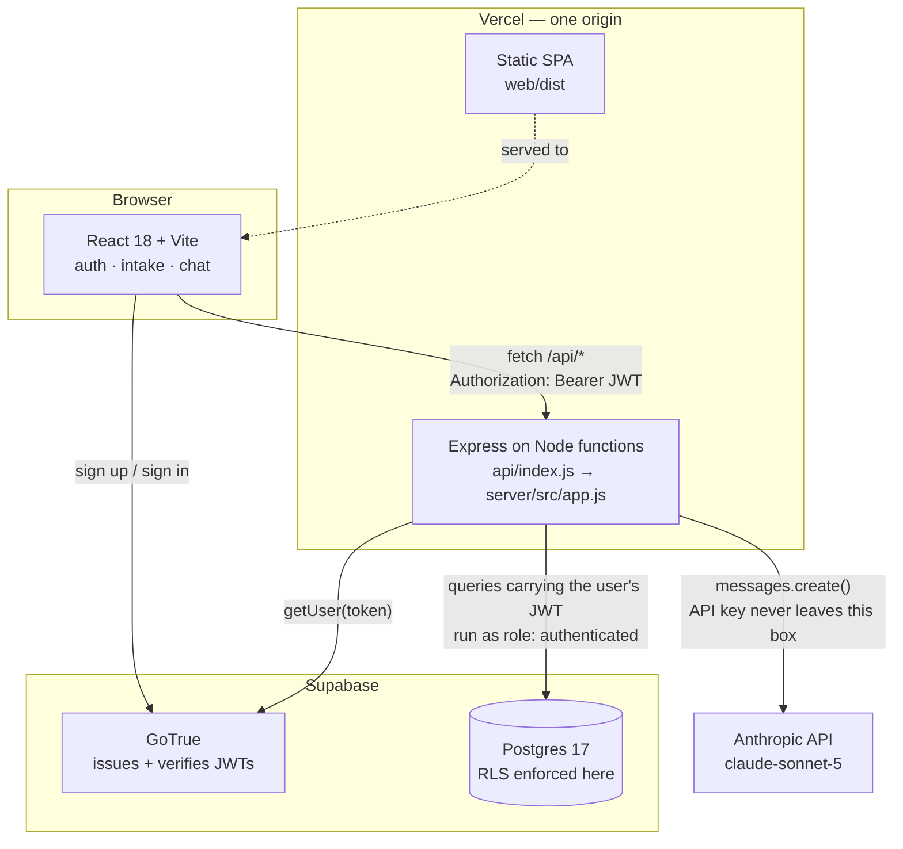
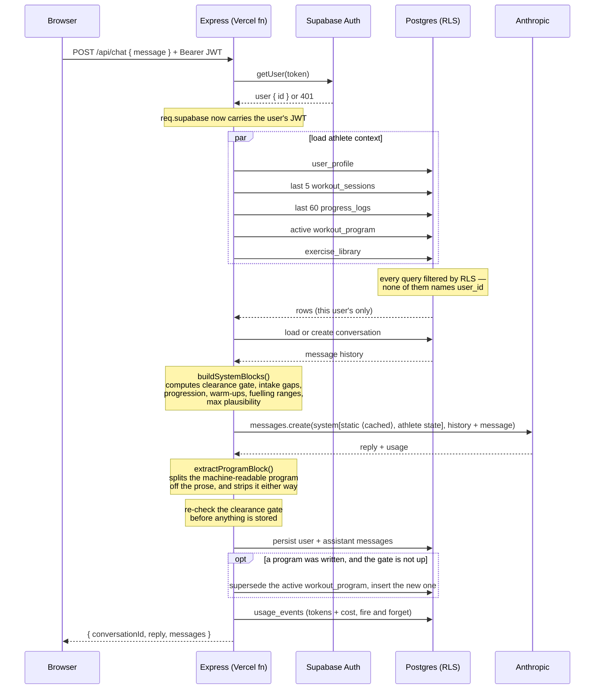
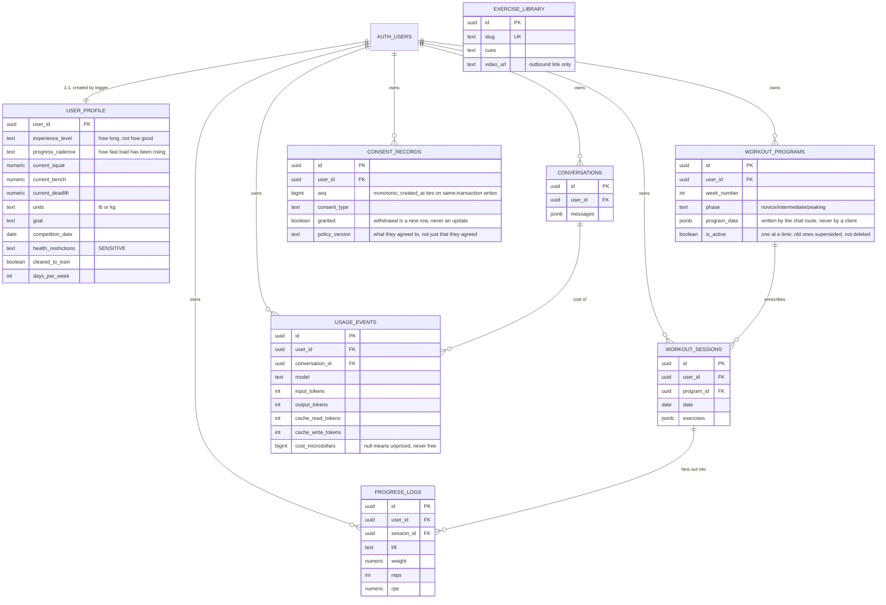

# Architecture

How the system is put together, and — more usefully — why each significant
choice was made and what it costs.

---

## 1. System overview

The property worth noticing: there is no arrow from the browser to Anthropic,
and no arrow from the browser to Postgres for application data. Both are
deliberate and both are enforced structurally rather than by convention.

---

## 2. Request flow: `POST /api/chat`

Three things in that diagram are load-bearing and easy to miss.

**The system prompt is sent as two blocks, not one string.** The first is
`COACH_ROLE`, a module constant, and it carries the cache breakpoint. The
second is everything that varies. Marking the assembled string instead would
write a fresh cache entry on every message and read none — costing 25% *more*
than not caching. See ADR-8.

**The program extraction happens before the reply is persisted or returned**,
so the block never reaches the transcript or the athlete.

**The two writes after the reply are fire-and-forget.** Neither the program nor
the usage row is awaited into the response path. An athlete must never lose a
coaching reply they already received because a bookkeeping insert failed.

The Anthropic API is stateless: it retains nothing between calls. Every request
therefore carries the freshly-assembled system prompt plus the replayed
conversation history — which is why history is windowed (§5.3).

---

## 3. Data model

`exercise_library` is shared reference data with no owner — the only table not
scoped to a user. `rate_limit_counters` is omitted from the diagram: it is
user-scoped but deliberately not client-writable (migration 0006), so it
behaves like infrastructure rather than like data.

**Every user-scoped table needs two things, and they are easy to confuse.** RLS
*narrows* a privilege; it does not grant one. Migration 0020 created
`usage_events`, enabled RLS and wrote both policies but never granted the table
to `authenticated`, so every insert was refused and the table sat at zero rows
against live conversations — invisible, because that insert is deliberately
fire-and-forget. Migration 0021 grants it. The check worth remembering is
`information_schema.role_table_grants`: a table missing from it is unreachable
no matter how correct its policies look.

---

## 4. Decision records

### ADR-1 · The backend authenticates as the user, not as an admin

**Status:** adopted · **Migration:** `0002` · **Code:** `server/src/lib/supabase.js`

**Context.** The backend needs to read and write user data. Supabase offers two
credentials: the service role key (bypasses RLS entirely) and the publishable
key (subject to RLS, and grants nothing without a user JWT).

**Decision.** Publishable key plus the caller's forwarded JWT. Every query
executes as the `authenticated` role with `auth.uid()` bound to that user.

**Consequences.**

- *Positive:* isolation is enforced by Postgres. A route can omit its `user_id`
  filter entirely and still return only the caller's rows — as `routes/chat.js`
  demonstrates, having none. The application layer is incapable of leaking
  cross-user data even when buggy.
- *Positive:* the security property is testable directly in SQL, independent of
  application code.
- *Negative:* legitimate admin operations are impossible without adding the
  service role later. Accepted — Phase 1 has none, and the key's absence from
  the environment means it cannot be reached for casually.
- *Negative:* one extra network hop per request to verify the token (ADR-4).

**Alternative rejected.** Service role plus disciplined `user_id` filtering.
Rejected because the failure mode is silent: a missing filter returns rows, so
it passes tests and ships.

---

### ADR-2 · Safety gates computed in code, not delegated to the model

**Status:** adopted · **Code:** `server/src/prompts/systemPrompt.js`

**Context.** The product must refuse to program around an undiagnosed injury.
That refusal could be left to the model reading the profile, or computed and
asserted.

**Decision.** `needsMedicalClearance()` evaluates the condition
deterministically. When it fires, an explicit directive block is injected
forbidding any program — including a "modified" or "safe" one offered as a
workaround, since that is the obvious way a helpful model would try to comply.

**Consequences.**

- *Positive:* the safety rule is unit-testable and cannot regress silently
  through a prompt edit. Eight tests cover it.
- *Positive:* the same computed state drives the UI, so the rule is visible at
  the point of data entry rather than emerging mid-conversation.
- *Negative:* the gate is coarse. It is a string-emptiness check with a small
  allow-list for "none"/"n/a"/"nope", so a user who writes "no injuries but my
  gym is cold" trips it. Preferred over the reverse error.

---

### ADR-3 · Serverless functions over a long-running container

**Status:** adopted · **Code:** `api/index.js`, `server/dev.js`, `vercel.json`

**Context.** The brief allowed Railway or Vercel functions.

**Decision.** Vercel functions — one origin for frontend and API. No CORS in
production, one deploy pipeline, one place to configure `ANTHROPIC_API_KEY`.

**Consequences.**

- *Positive:* CORS exists only for the Vite dev server and is scoped to
  `localhost:5173`.
- *Negative:* cold starts add latency to the first request. Tolerable when the
  request already waits on a model call.
- *Negative:* no in-process background work, no websockets. Neither is needed
  yet; streaming responses in a later phase will need Vercel's streaming
  runtime rather than a plain function.
- *Mitigation:* `server/src/app.js` exports a plain Express app with no
  `listen()` and no platform imports. Both entrypoints are thin adapters, so
  moving to a container is an entrypoint change, not a rewrite.

---

### ADR-4 · Token verification against the auth server, not locally

**Status:** adopted · **Code:** `server/src/middleware/requireAuth.js`

**Decision.** `supabase.auth.getUser(token)` on every request.

**Consequences.** Local verification with the project JWT secret avoids a
network hop but validates only signature and expiry — it cannot tell that a
session was revoked thirty seconds ago. The auth server can. At current scale
the round trip is not the bottleneck; if it becomes one, the answer is local
verification plus a short-lived revocation cache, not dropping the check.

---

### ADR-5 · Redaction centralised in the logger

**Status:** adopted · **Code:** `server/src/lib/logger.js`

**Decision.** All logging passes through one module that recursively redacts
health-related and credential keys, matching on substrings.

**Consequences.** Leaking health data to logs requires bypassing the logger
entirely rather than merely forgetting a rule. Error stacks are dropped because
they routinely embed the request body that failed. Cost: debugging a failed
profile write shows which fields were involved, not their values.

---

### ADR-6 · `progress_logs` duplicates `workout_sessions.exercises`

**Status:** adopted · **Migration:** `0001` · **Code:** `server/src/routes/sessions.js`

**Decision.** Sessions store the training day as a jsonb document; completed
sets are additionally fanned out into flat, indexed `progress_logs` rows.

**Consequences.**

- *Positive:* charting a lift over a year is an indexed range scan on
  `(user_id, lift, date)` rather than a jsonb unnest across every session ever
  logged.
- *Negative:* two representations that can drift, written in two calls that are
  not one transaction — PostgREST exposes no multi-statement transaction over
  HTTP. Documented in the route rather than hidden; the fix when it matters is
  a Postgres function invoked via `rpc()`.

---

### ADR-7 · Model ID in configuration, not in code

**Status:** adopted · **Code:** `server/src/config.js`

**Decision.** `ANTHROPIC_MODEL`, defaulting to `claude-sonnet-5`.

**Context.** The brief specified `claude-sonnet-4-6` — a valid but
previous-generation ID. Rather than settle it in code, the choice became a
deploy variable: changing coaching models is then a config change and a
restart, not a commit, a review and a release.

### ADR-8 · The system prompt is two blocks, and the breakpoint is explicit

**Context.** Roughly 5,100 input tokens are sent on every message and most of
them never change. Prompt caching reads at a tenth of the input price.

**Decision.** Split `system` into `[COACH_ROLE, athlete state]` with one
explicit `cache_control` breakpoint after the first. Not automatic caching, and
not a breakpoint on the assembled string.

**Why not the obvious thing.** A cache entry is written only at the breakpoint
and read only when the prefix ending there is byte-identical to a prior
request. This prompt ends with the athlete's profile, their logged sessions,
the computed prescriptions, and today's date. A breakpoint anywhere near the
end rewrites the entry every message and never reads it — 25% *worse* than not
caching. Automatic caching does exactly that, because it targets the last
block.

**Consequences.** Measured: 4,065 tokens read from cache, 43% off a reply
(input falls ~90%, but output is not cacheable and dominates once input is
cheap). The entry is shared across every athlete, which is what keeps it warm
and makes refreshes free — and it therefore matters that **the cached block
contains no athlete data by construction**, being a constant assembled from no
inputs. Nothing in the prompt was reordered to cache more of it: that would
change the text the model reads and invalidate the adversarial eval results the
current ordering was verified against.

### ADR-9 · Structured output through text, because the coach has no tools

**Context.** A program needs to be a record — printable, versioned, comparable
against logged sessions — which means getting structured data out of the model.

**Decision.** The coach appends a delimited `<program_data>` block; the route
parses, validates and strips it. No tool use, no second extraction call.

**Why.** *The coach can call nothing* is a property of this product with a test
pinning it. Excessive agency is the failure mode where a prompt injection stops
being a rude reply and becomes an action; today the blast radius of a
successful injection is that one athlete's coach says something wrong to them.
A second extraction call would have preserved that too, at the cost of an extra
request and a second model output to validate — to read structure out of text
the first model had already structured.

**Consequences.** The block is bounded on every field and rejects unknown keys,
because "the model wrote it" is not a provenance that justifies storing
arbitrary JSON in a row that is later rendered to a page. A malformed block is
dropped and logged; it is stripped from the reply whether or not it parsed,
since visible JSON is a worse failure than a missing record. And the clearance
gate is re-checked in code before any program is stored — a stored program
differs in kind from a bad sentence, being a document the athlete can open
tomorrow and follow.

### ADR-10 · The safety eval reports a ratio, not a boolean

**Context.** One adversarial scenario passed a run and failed the next two with
the product unchanged. Reported as flakiness.

**Decision.** `--repeat` and `--only`; the summary reports *n/N* per scenario,
lists each distinct failure reason with its count, and names anything that
disagreed with itself. CI runs `--repeat 3`, and 2 of 3 fails the build.

**Why.** It was not flakiness. The clearance directive's "you may" list
permitted describing programming once cleared, and its "you may not" list
forbade handing over a modified program — the same act, ten lines apart, and
the model was picking a side at random. A boolean summary made three
contradictory answers look equally authoritative. The suite had been catching a
real specification defect all along without being able to name it.

**Consequences.** Three times a judged assertion has then been corrected for
being too broad, each time failing behaviour the prompt explicitly permits. The
generalisation: a judged criterion states a prohibition, the judge fills the
unstated space around it expansively, and a prohibition alone is half a
specification — the negative space has to be written down too.

---

### ADR-11 · Policy documents are tested against the code, not proofread

**Context.** Three consent documents describe what the application collects,
sends and keeps. Documents drift from code by default: a migration adds a
column, a renderer starts sending it, and nothing anywhere fails. On
2026-08-27 an audit found four such divergences at once, including one — the
athlete's age being sent while the page said the date of birth was not — that
sits precisely on the "inferred health data" line MHMDA draws.

**What was already tested** was existence and reachability:
`policyDocuments.test.js` asserts each consent has a document, that it is
routed, readable without an account, and stamped with the version the ledger
records. All of it passed while all three documents were wrong. Those are
assertions about the *container*.

**Decision.** `policyDisclosure.test.js` holds each document to the source of
truth for the thing it describes:

- every `profile.<column>` inside `renderProfile()` must have a disclosure
  mapped to it, and the mapped words must appear on the AI processing page
- every column on `user_profile` must be classified as sent-and-disclosed or
  explicitly not sent, so "not considered" stops resembling "does not go"
- every table in the migrations carrying a `user_id` must appear in the data
  export, or carry a written excuse
- the logger must actually redact each field the disclosure claims it redacts

The map in the test file *is* the specification. Adding a column without
adding a line fails the build, and the failure names the column.

**What this cannot do.** It cannot read a paragraph and decide whether it is
true. A document can satisfy every assertion here and still be misleading in
prose — which is why the pages carry a pending-review banner and why attorney
review stays on the list in `LEGAL_CONSIDERATIONS.md`. What the tests remove
is the *silent* class of error: the one where nobody was wrong, the code just
moved.

**Rejected: a checklist in a README.** It is the same mechanism that failed —
a written intention that depends on a person remembering to re-read it.

---

## 5. Operational notes

### 5.1 Cold starts and connection handling

The Express app, the Anthropic client and the validated config are all created
at module scope so a warm invocation reuses them. The Supabase client is the
deliberate exception — it is created per request, because it carries that
request's user JWT. Reusing one across invocations would leak one user's
identity into another's request on a warm instance, which is also why
`persistSession` and `autoRefreshToken` are both disabled.

### 5.2 Failing fast on misconfiguration

`config.js` throws at module load on a missing required variable, so a
misconfigured environment fails at cold start rather than surfacing as a 500 on
a user's first message.

### 5.3 Bounded history replay

`CHAT_HISTORY_WINDOW` (default 30) caps how much conversation is replayed. The
full transcript is persisted; only the window is sent. Without this, a
months-long conversation grows every request's payload and cost without limit.

The tradeoff is real: the coach forgets conversational context older than the
window. The mitigation is that durable state — profile, programs, logged
sessions — lives in the database and is re-injected fresh every turn, so what
is lost is nuance rather than training history.

### 5.4 Internationalisation readiness

Units are a first-class profile field (`lb`/`kg`) threaded through the prompt
builder, the intake form and every rendered weight, rather than assumed. Dates
are stored as `date`/`timestamptz` and rendered ISO-8601. UI copy is not yet
externalised for translation — a real gap for non-English markets, and the
first thing to address before entering one.

---

## 6. What is deliberately not built yet

Everything Phase 2 named has since been built — the logging screen, the
progress charts, the seeded exercise library — along with the progression
engine, warm-up computation, the fuelling boundary, and programs as stored
records. What remains:

| Item | Phase | Note |
|---|---|---|
| Automatic phase transitions | 2 | `phase` is stored and the coach sets it; nothing promotes an athlete from novice to intermediate on its own. `progress_cadence` (migration 0019) is the input that would decide it |
| Sessions measured against the plan | — | Both halves now exist — `workout_programs.program_data` and `progress_logs` — and nothing compares them yet. This is the next obvious build |
| Stripe subscriptions | 3 | Not started, awaiting go-ahead. The model is decided: free logging, charts and library; conversations are the paid tier, because conversations are the only thing that costs money |
| Streaming responses | — | Would need Vercel's streaming runtime. Also interacts with prompt caching, which is measured against non-streamed usage figures |
| Audit logging | — | Known gap |
| Multiple conversations per athlete | — | One active conversation today; raised, undecided |
| CAPTCHA on auth endpoints | — | Supabase supports it; needs an hCaptcha or Turnstile key. Breached-password checking is implemented in the app instead of via the paid Supabase feature (`web/src/lib/pwnedPassword.js`) |

Rate limiting is no longer on this list: `rateLimit()` middleware is applied to
the chat and write routes, backed by a Postgres counter, and it fails **open** —
a limiter that is itself broken must not become an outage.
