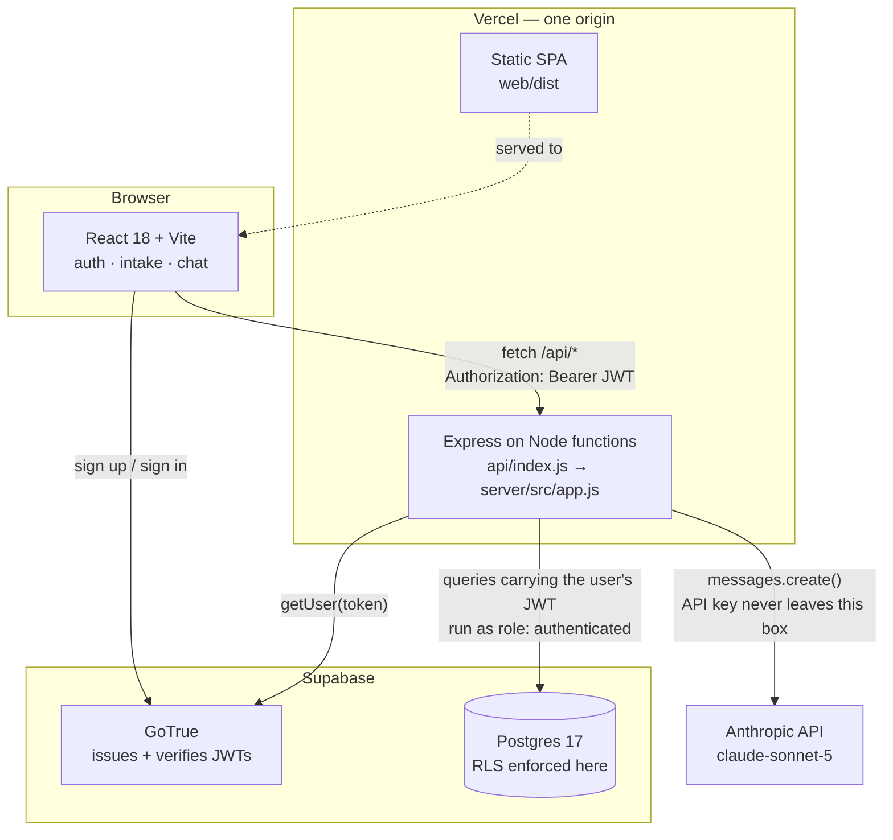
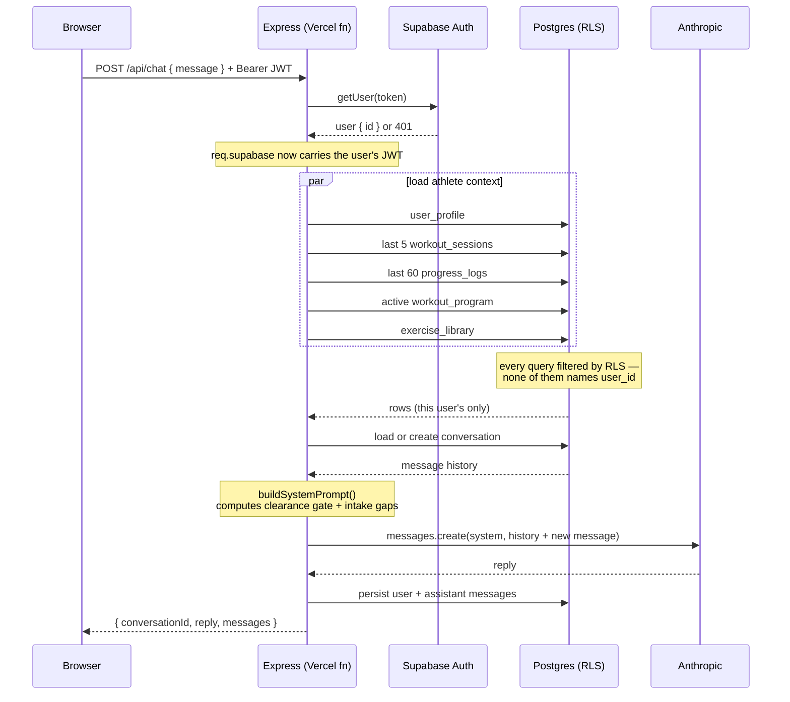
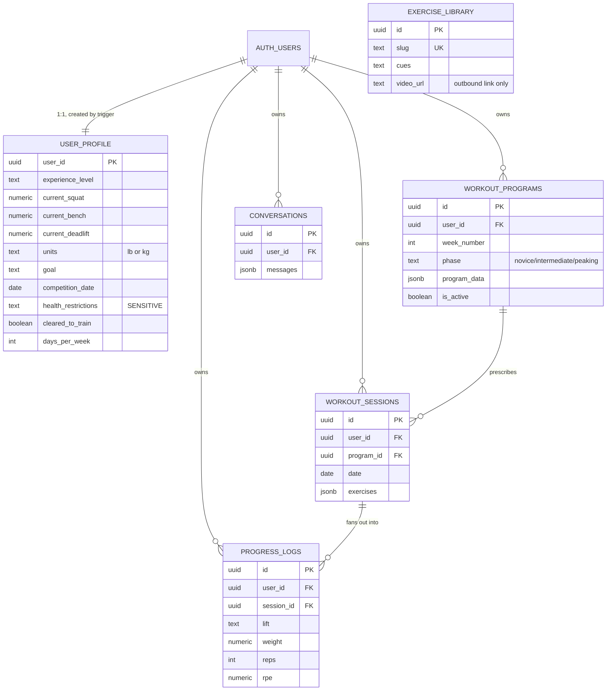

# Architecture

How the system is put together, and — more usefully — why each significant
choice was made and what it costs.

---

## 1. System overview

The property worth noticing: there is no arrow from the browser to Anthropic,
and no arrow from the browser to Postgres for application data. Both are
deliberate and both are enforced structurally rather than by convention.

---

## 2. Request flow: `POST /api/chat`

The Anthropic API is stateless: it retains nothing between calls. Every request
therefore carries the freshly-assembled system prompt plus the replayed
conversation history — which is why history is windowed (§5.3).

---

## 3. Data model

`exercise_library` is shared reference data with no owner — the only table not
scoped to a user.

---

## 4. Decision records

### ADR-1 · The backend authenticates as the user, not as an admin

**Status:** adopted · **Migration:** `0002` · **Code:** `server/src/lib/supabase.js`

**Context.** The backend needs to read and write user data. Supabase offers two
credentials: the service role key (bypasses RLS entirely) and the publishable
key (subject to RLS, and grants nothing without a user JWT).

**Decision.** Publishable key plus the caller's forwarded JWT. Every query
executes as the `authenticated` role with `auth.uid()` bound to that user.

**Consequences.**

- *Positive:* isolation is enforced by Postgres. A route can omit its `user_id`
  filter entirely and still return only the caller's rows — as `routes/chat.js`
  demonstrates, having none. The application layer is incapable of leaking
  cross-user data even when buggy.
- *Positive:* the security property is testable directly in SQL, independent of
  application code.
- *Negative:* legitimate admin operations are impossible without adding the
  service role later. Accepted — Phase 1 has none, and the key's absence from
  the environment means it cannot be reached for casually.
- *Negative:* one extra network hop per request to verify the token (ADR-4).

**Alternative rejected.** Service role plus disciplined `user_id` filtering.
Rejected because the failure mode is silent: a missing filter returns rows, so
it passes tests and ships.

---

### ADR-2 · Safety gates computed in code, not delegated to the model

**Status:** adopted · **Code:** `server/src/prompts/systemPrompt.js`

**Context.** The product must refuse to program around an undiagnosed injury.
That refusal could be left to the model reading the profile, or computed and
asserted.

**Decision.** `needsMedicalClearance()` evaluates the condition
deterministically. When it fires, an explicit directive block is injected
forbidding any program — including a "modified" or "safe" one offered as a
workaround, since that is the obvious way a helpful model would try to comply.

**Consequences.**

- *Positive:* the safety rule is unit-testable and cannot regress silently
  through a prompt edit. Eight tests cover it.
- *Positive:* the same computed state drives the UI, so the rule is visible at
  the point of data entry rather than emerging mid-conversation.
- *Negative:* the gate is coarse. It is a string-emptiness check with a small
  allow-list for "none"/"n/a"/"nope", so a user who writes "no injuries but my
  gym is cold" trips it. Preferred over the reverse error.

---

### ADR-3 · Serverless functions over a long-running container

**Status:** adopted · **Code:** `api/index.js`, `server/dev.js`, `vercel.json`

**Context.** The brief allowed Railway or Vercel functions.

**Decision.** Vercel functions — one origin for frontend and API. No CORS in
production, one deploy pipeline, one place to configure `ANTHROPIC_API_KEY`.

**Consequences.**

- *Positive:* CORS exists only for the Vite dev server and is scoped to
  `localhost:5173`.
- *Negative:* cold starts add latency to the first request. Tolerable when the
  request already waits on a model call.
- *Negative:* no in-process background work, no websockets. Neither is needed
  yet; streaming responses in a later phase will need Vercel's streaming
  runtime rather than a plain function.
- *Mitigation:* `server/src/app.js` exports a plain Express app with no
  `listen()` and no platform imports. Both entrypoints are thin adapters, so
  moving to a container is an entrypoint change, not a rewrite.

---

### ADR-4 · Token verification against the auth server, not locally

**Status:** adopted · **Code:** `server/src/middleware/requireAuth.js`

**Decision.** `supabase.auth.getUser(token)` on every request.

**Consequences.** Local verification with the project JWT secret avoids a
network hop but validates only signature and expiry — it cannot tell that a
session was revoked thirty seconds ago. The auth server can. At current scale
the round trip is not the bottleneck; if it becomes one, the answer is local
verification plus a short-lived revocation cache, not dropping the check.

---

### ADR-5 · Redaction centralised in the logger

**Status:** adopted · **Code:** `server/src/lib/logger.js`

**Decision.** All logging passes through one module that recursively redacts
health-related and credential keys, matching on substrings.

**Consequences.** Leaking health data to logs requires bypassing the logger
entirely rather than merely forgetting a rule. Error stacks are dropped because
they routinely embed the request body that failed. Cost: debugging a failed
profile write shows which fields were involved, not their values.

---

### ADR-6 · `progress_logs` duplicates `workout_sessions.exercises`

**Status:** adopted · **Migration:** `0001` · **Code:** `server/src/routes/sessions.js`

**Decision.** Sessions store the training day as a jsonb document; completed
sets are additionally fanned out into flat, indexed `progress_logs` rows.

**Consequences.**

- *Positive:* charting a lift over a year is an indexed range scan on
  `(user_id, lift, date)` rather than a jsonb unnest across every session ever
  logged.
- *Negative:* two representations that can drift, written in two calls that are
  not one transaction — PostgREST exposes no multi-statement transaction over
  HTTP. Documented in the route rather than hidden; the fix when it matters is
  a Postgres function invoked via `rpc()`.

---

### ADR-7 · Model ID in configuration, not in code

**Status:** adopted · **Code:** `server/src/config.js`

**Decision.** `ANTHROPIC_MODEL`, defaulting to `claude-sonnet-5`.

**Context.** The brief specified `claude-sonnet-4-6` — a valid but
previous-generation ID. Rather than settle it in code, the choice became a
deploy variable: changing coaching models is then a config change and a
restart, not a commit, a review and a release.

---

## 5. Operational notes

### 5.1 Cold starts and connection handling

The Express app, the Anthropic client and the validated config are all created
at module scope so a warm invocation reuses them. The Supabase client is the
deliberate exception — it is created per request, because it carries that
request's user JWT. Reusing one across invocations would leak one user's
identity into another's request on a warm instance, which is also why
`persistSession` and `autoRefreshToken` are both disabled.

### 5.2 Failing fast on misconfiguration

`config.js` throws at module load on a missing required variable, so a
misconfigured environment fails at cold start rather than surfacing as a 500 on
a user's first message.

### 5.3 Bounded history replay

`CHAT_HISTORY_WINDOW` (default 30) caps how much conversation is replayed. The
full transcript is persisted; only the window is sent. Without this, a
months-long conversation grows every request's payload and cost without limit.

The tradeoff is real: the coach forgets conversational context older than the
window. The mitigation is that durable state — profile, programs, logged
sessions — lives in the database and is re-injected fresh every turn, so what
is lost is nuance rather than training history.

### 5.4 Internationalisation readiness

Units are a first-class profile field (`lb`/`kg`) threaded through the prompt
builder, the intake form and every rendered weight, rather than assumed. Dates
are stored as `date`/`timestamptz` and rendered ISO-8601. UI copy is not yet
externalised for translation — a real gap for non-English markets, and the
first thing to address before entering one.

---

## 6. What is deliberately not built yet

| Item | Phase | Note |
|---|---|---|
| Structured session-logging UI | 2 | API exists (`POST /api/sessions`); no dedicated screen |
| Progress charts | 2 | `GET /api/sessions/progress` returns the data |
| Exercise library seeding | 2 | Table and read API exist; needs verified third-party URLs |
| Automatic phase transitions | 2 | `phase` is stored; transitions are not yet automated |
| Stripe subscriptions | 3 | Not started, awaiting go-ahead |
| Rate limiting | — | Known gap, see `SECURITY.md` |
| Streaming responses | — | Would need Vercel's streaming runtime |
| Audit logging | — | Known gap |
